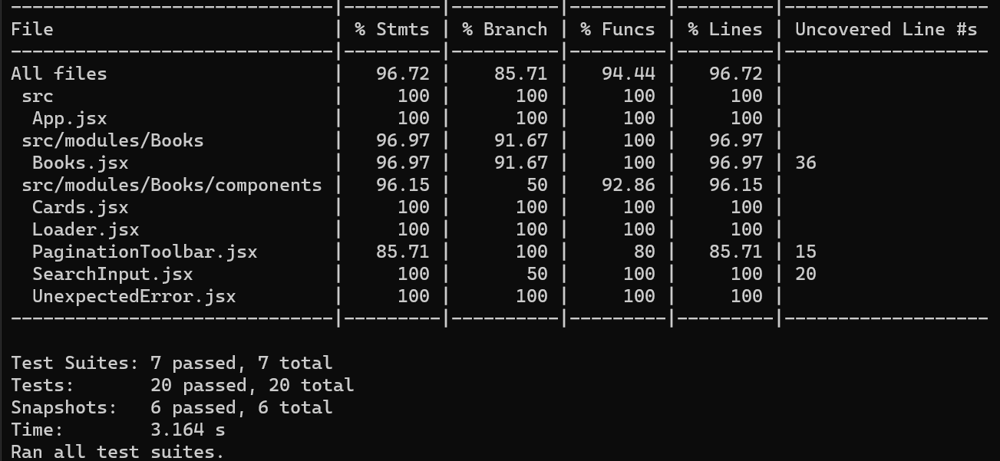
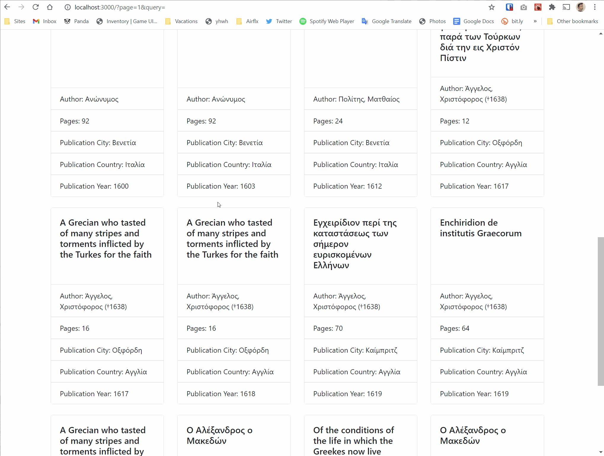

# OnTrack Test

## Notes to the reviewer

A simple app created with `create-react-app` and `react-bootstrap`. I could have used `redux` but I kept it simple.

## How to test

1. Clone the repo
2. Run `npm install`
3. Run `npm start`
4. Open the [page](http://localhost:3000)

## Unit Test Coverage

## Demo

